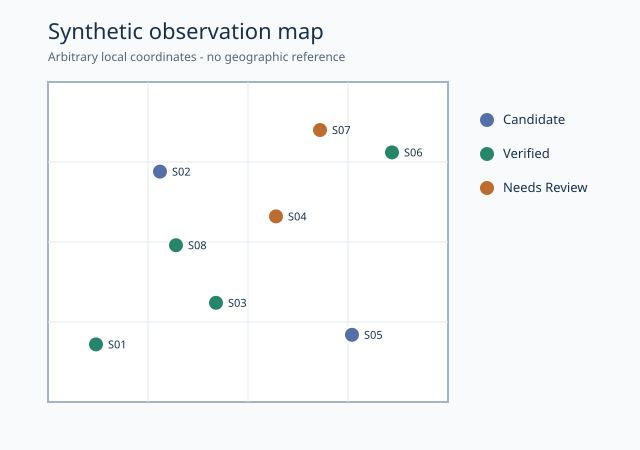

# Geospatial Reporting from Synthetic Observations

This branch turns a small set of invented observations into a category summary and a schematic map. It demonstrates the reporting steps around spatial-style data: validate records, count categories, render points consistently, and publish an understandable output. There is no real imagery or geographic coordinate system in this sample.

## Example deliverables

The script contains eight fixed observations in a unit square. The generated [report](sample_output/report.md) has four `verified`, two `candidate`, and two `needs review` records. The [SVG map](sample_output/map.svg) plots the same eight IDs and uses a color legend.



The visual is a schematic, not an aerial image or geographic map. Positions from 0 to 1 are arbitrary local coordinates, not latitude, longitude, or customer locations.

## Workflow

| Stage | Public implementation | Check |
| --- | --- | --- |
| Input | `Observation` records with an ID, unit-square position, and category | Reject empty IDs, unknown categories, non-finite or out-of-range positions, and duplicate IDs |
| Summary | Count categories and calculate shares | Ensure category totals match all observations |
| Map | Transform local coordinates into SVG positions, draw a grid and legend | Escape displayed IDs before inserting them into SVG |
| Report | Write a Markdown table linked to the SVG | Generate both files from the same observations |

## Reproduce

Use Python 3.11 and the standard library:

```powershell
python synthetic_reporting.py --output-dir output
python -m unittest discover -s tests -v
```

Open `output/report.md` and `output/map.svg`. The committed `sample_output/` files show the expected result and can be regenerated from the script. Three tests check the counts, validation and escaping, and whether the generated files match the renderers. [GitHub Actions](.github/workflows/tests.yml) runs the tests on pushes to this branch.

## Scope

This is a reporting demonstration, not an operational GIS system. It does not ingest aerial imagery, georeference points, assess detection accuracy, or make claims about real sites. No private notebook, flowchart, customer record, or source image is included. The [portfolio index](https://github.com/kunalaher168-coder/machine-learning-portfolio) links the other samples.
